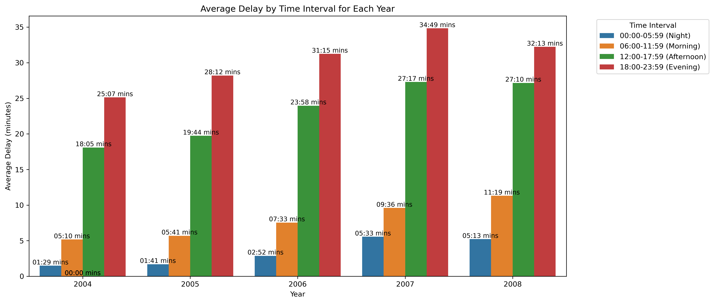
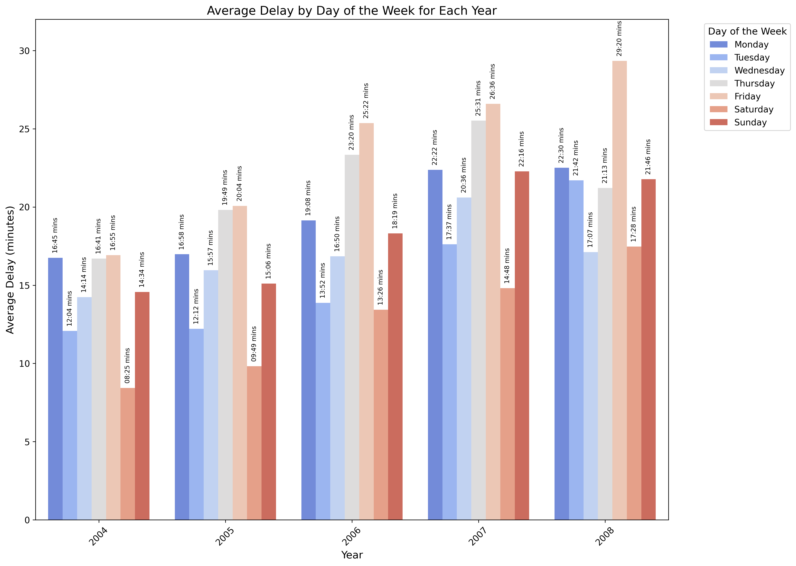
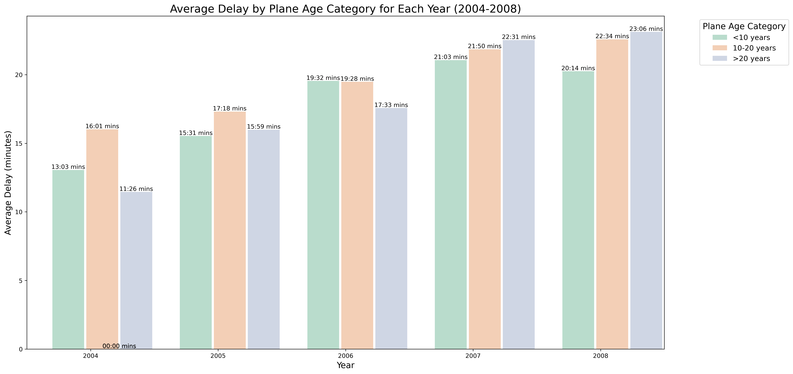
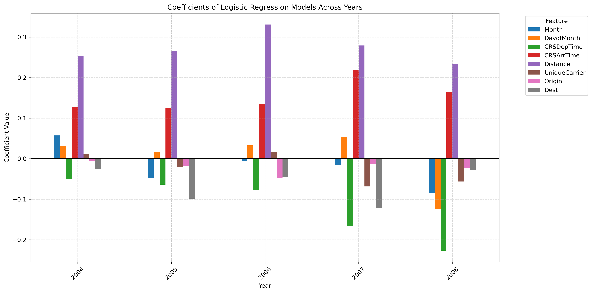

# US Flight Delay & Diversion Analysis

A large-scale data analysis project examining flight delays and diversions across US commercial flights from **2004–2008** using **Python and R**.

The project explores when passengers are least likely to experience delays, whether aircraft age is associated with flight delays, and whether flight characteristics can be used to predict diversions.

## Project Objectives

The analysis focuses on three main questions:

1. **When is the best time to fly?**  
   Identify the times of day and days of the week associated with the lowest average flight delays.

2. **Does aircraft age affect delays?**  
   Investigate whether older aircraft experience greater delays compared with newer aircraft.

3. **Can flight diversions be predicted?**  
   Build logistic regression models to estimate the probability of a flight being diverted based on flight characteristics.

## Dataset

The project uses US commercial flight data from the **2009 ASA Statistical Computing and Graphics Data Expo**, covering the years **2004–2008**.

**Data source:** Harvard Dataverse  
**Dataset DOI:** https://doi.org/10.7910/DVN/HG7NV7

The yearly datasets contain millions of flight records and include information such as:

- Scheduled and actual departure/arrival times
- Departure and arrival delays
- Airline carrier
- Origin and destination airports
- Flight distance
- Aircraft tail number
- Cancellation and diversion status

Additional aircraft data was used to estimate aircraft age.

> **Note:** Raw datasets are not included in this repository due to their size. They can be obtained from the dataset source above.

## Technologies Used

**Python**
- Pandas
- NumPy
- Matplotlib
- Scikit-learn

**R**
- Tidyverse
- dplyr
- ggplot2
- caret
- pROC

**Techniques**
- Data Cleaning & Preprocessing
- Exploratory Data Analysis
- Feature Engineering
- Data Visualisation
- Logistic Regression
- ROC-AUC Model Evaluation

## Data Preparation

The raw yearly datasets were cleaned before analysis. Key preprocessing steps included:

- Removing duplicate records
- Excluding cancelled flights
- Handling missing values
- Converting scheduled flight times into usable time formats
- Combining yearly datasets from 2004–2008
- Engineering additional variables such as aircraft age and time-of-day categories

The analysis involved processing several million flight records per year.

## Key Findings

### 🕐 Best Time to Fly

Flights departing during the **night period (00:00–05:59)** consistently recorded the lowest average delays across all five years.

In contrast, **evening flights (18:00–23:59)** experienced the highest average delays each year, suggesting that delays tend to accumulate throughout the day.

### Best Day to Fly

**Saturday** recorded the lowest average delay from **2004–2007**, while **Wednesday** recorded the lowest average delay in **2008**.

The results show that average delays varied considerably depending on the day of the week and year.

### Aircraft Age & Delays

Aircraft were grouped into three age categories:

- **New:** less than 10 years old
- **Mid-aged:** 10–20 years old
- **Old:** more than 20 years old

The relationship between aircraft age and delays changed across the five-year period. Older aircraft did not consistently experience greater delays in the earlier years, although they recorded the highest average delays in **2007 and 2008**.

This suggests that aircraft age alone is not sufficient to explain flight delays, as other operational factors may also influence delay performance.

### Flight Diversion Prediction

Logistic regression models were developed to estimate the probability of a flight being diverted.

The models used features including:

- Month and day of month
- Scheduled departure and arrival times
- Flight distance
- Airline carrier
- Origin airport
- Destination airport

Across the yearly models, **flight distance and scheduled arrival time showed consistently positive coefficients**, while scheduled departure time showed a negative relationship with diversion probability.

Yearly models achieved ROC-AUC scores of approximately **0.60–0.64**, while the combined five-year model achieved approximately **0.62 ROC-AUC**.

These results indicate some predictive ability, while also suggesting that additional variables such as weather and airport conditions could improve diversion prediction.

## Repository Contents

- `flight_delay_analysis_python.ipynb` — Complete Python analysis
- `flight_delay_analysis_r.Rmd` — Complete R analysis

## Skills Demonstrated

This project demonstrates experience with:

- Working with large-scale datasets
- Data cleaning and transformation
- Exploratory data analysis
- Feature engineering
- Statistical modelling
- Classification using logistic regression
- Model evaluation using ROC-AUC
- Data visualisation
- Implementing equivalent analytical workflows in Python and R
